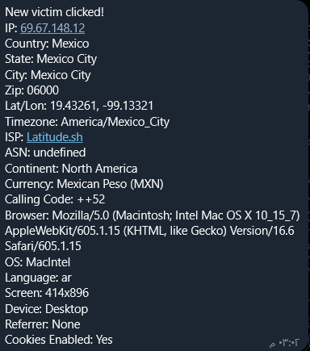

<!-- HERO SECTION -->
<p align="center">
  
</p>

<h1 align="center">ScayCute 🐾</h1>
<p align="center"><b>The ultimate cute-to-scary prank web app!</b></p>
<p align="center">
  <a href="#features"></a>
  <a href="#screenshots"></a>
  <a href="#license"></a>
  <a href="https://github.com/Scayar/ScayCute/stargazers"></a>
</p>

---

## 📑 Table of Contents
- [🚀 Introduction](#-introduction)
- [✨ Features](#-features)
- [📸 Screenshots](#-screenshots)
- [⚡ Quick Start](#-quick-start)
- [🛠️ How to Use](#-how-to-use)
- [🚦 Advanced Features (APIs)](#-advanced-features-apis)
- [🤝 Contributing](#-contributing)
- [👤 Author & Contact](#-author--contact)
- [📄 License](#-license)

---

## 🚀 Introduction

> **ScayCute** is a modern, open-source prank web app. It starts with an adorable cat, then shocks users with a scary reveal and displays their device info in a stylish, animated interface. Perfect for fun, pranks, and learning about web UI/UX!

---

## ✨ Features

- 🖥️ **Modern, responsive UI** (desktop & mobile)
- 🐱 **Cute landing page** with glassmorphic button
- 👻 **Scary jump-scare** with video, audio, and effects
- 🕶️ **Animated, glitchy info display**
- 🔒 **No APIs required by default** — works 100% offline
- 🚀 **Easy to run locally** or on any static web host
- 🛡️ [Optional] Add your own API keys for advanced info and Telegram alerts

---

## 📸 Screenshots

| Landing Page | Scary Info Page | Telegram Example |
|:---:|:---:|:---:|
|  |  |  |

---

## ⚡ Quick Start

```bash
git clone https://github.com/Scayar/ScayCute.git
cd ScayCute
python -m http.server 8000 --bind 0.0.0.0
```
Open [http://localhost:8000](http://localhost:8000) in your browser.

---

## 🛠️ How to Use

1. **Clone or Download the Repo**
2. **Run a Local Server** (see Quick Start above)
3. **Open in Your Browser**
4. **(Optional) Share Publicly with ngrok**
   - Download [ngrok](https://ngrok.com/download) and run:
     ```bash
     ngrok http 8000
     ```
   - Share the public URL ngrok gives you!

---

<details>
<summary>🚦 <b>Advanced Features (APIs)</b> (click to expand)</summary>

Want to show real IP/location info or get Telegram alerts?

1. Open `script.js` and fill in your own API keys at the top:
   ```js
   const IPGEOLOCATION_API_KEY = ""; // <-- Put your ipgeolocation.io API key here
   const TELEGRAM_BOT_TOKEN = ""; // <-- Put your Telegram bot token here
   const TELEGRAM_CHAT_ID = ""; // <-- Put your Telegram chat ID here
   ```
2. Save and reload the site. Now advanced info and Telegram alerts will work!

> **Note:** By default, the tool is 100% offline and safe for public use.

</details>

---

## 🤝 Contributing

Contributions are welcome! If you have ideas, bug fixes, or new features, feel free to open an issue or submit a pull request.

1. **Fork the repository**
2. **Create a new branch**
3. **Make your changes**
4. **Submit a pull request**

Please follow the code style and keep the README up to date.

---

## 👤 Author & Contact

- **Name:** Talal
- **Email:** [Scayar.exe@gmail.com](mailto:Scayar.exe@gmail.com)
- **Website:** [scayar.me](https://scayar.com)
- **Telegram Group:** [Join Scayar Group](https://t.me/im_scayar)
- **Buy Me a Coffee:** [Buy Me a Coffee](https://www.buymeacoffee.com/scayar)

---

## 📄 License

This project, **ScayCute**, is licensed under the MIT License. You are free to use, modify, and distribute it for personal or commercial purposes. See the [LICENSE](LICENSE) file for details.

---

<p align="center">
  <b>Made with ❤️ by <a href="https://scayar.me">Scayar</a> — for fun and learning!</b><br/>
  <a href="https://github.com/Scayar/ScayCute/stargazers">⭐ Star this repo</a>
</p>
